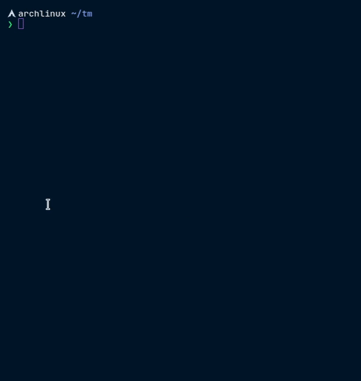
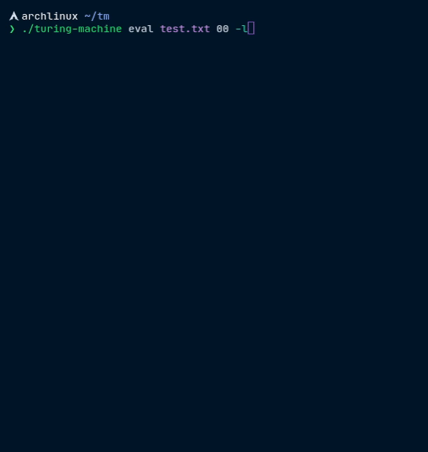

# Intérprete de máquinas de Turing

1. [Instalación](#instalación)
2. [Compilación](#compilación)
3. [Manual](#manual)

Un intérprete capaz de simular una máquina de Turing binaria a partir de su tabla de transición.
Además incluye diversas herramientas para generar información adicional como:

- La máquina de Turing normalizada correspondiente a la original.
- El número de Gödel que corresponde a la máquina de Turing normalizada.
- El grafo correspondiente a la máquina, así como grafos para visualizar paso a paso la ejecución de la máquina.
- Un lenguaje de más alto nivel, [abacus](./examples/abacus.txt), con registros numerados
  de números naturales, saltos condicionales y macros, que compila a máquinas de Turing.

Todas estas funcionalidades están disponibles a través de una interfaz de línea de comandos.

## Instalación

### Linux y Windows (a través del [WSL](https://ubuntu.com/wsl))

El programa pre-compilado se encuentra en la sección de Releases.

```bash
# Descargar la última versión, también sirve para actualizarlo.
curl -fLo turing-machine 'https://github.com/ggzor/turing-machines/releases/latest/download/turing-machine-Linux'
# Permitir ejecutar el binario
chmod u+x turing-machine
./turing-machine --help
```

> Nota: curl se encuentra instalado por defecto en la mayoría de las distribuciones de 
> Linux. En caso de no tenerlo instalado, cualquier otro método de descarga del ejecutable
> es válido.

> Nota para usuarios de Windows: Para acceder a los archivos desde el explorador se puede seguir
> este [tutorial](https://geekland.eu/acceder-a-los-ficheros-linux-de-wsl-desde-windows-10/).

Para la generación de los gráfos es necesario instalar 
[graphviz](https://graphviz.org/download/) y 
[rsvg-convert](https://command-not-found.com/rsvg-convert), con los comandos que se
encuentran en los enlaces dependiendo de la distribución de Linux.

Por ejemplo, para Ubuntu los siguientes comandos son suficientes:

```bash
sudo apt-get update
sudo apt-get upgrade
sudo apt-get install -y graphviz librsvg2-bin
```

### MacOS

El proceso de instalación es similar al de Linux, sin embargo, como este binario es 
dinámico, puede ser necesario instalar librerías adicionales.

```bash
brew install curl libffi gmp zlib librsvg graphviz
```

Y después:

```bash
# Descargar la última versión del binario dinámico
curl -fLo turing-machine 'https://github.com/ggzor/turing-machines/releases/latest/download/turing-machine-macOS'
chmod u+x turing-machine
./turing-machine --help
```

## Compilación

Si se desea compilar el código desde su fuente esto se puede hacer
fácilmente instalando [Nix](https://nixos.org/download.html), que se encargará de 
descargar todas las dependencias y realizar la compilación.

1. Instalar [nix](?) en caso de aún no estar instalado.

    ```
    curl -L https://nixos.org/nix/install | sh
    ```

2. Clonar este repositorio con [git](?) y moverse a la carpeta.

    ```bash
    git clone https://github.com/ggzor/turing-machines
    cd turing-machines
    ```

3. Ejecutar nix-build

    ```bash
    nix-build
    ```

4. El ejecutable se generará en la carpeta `result/bin/turing-machine`

    ```bash
    ./result/bin/turing-machine --help
    ```

## Manual

|  |
| :-: |
| Demostración del programa con generación de imágenes. |


|  |
| :-: |
| Las imágenes generadas por el programa. |

El programa incluye ayuda para cada uno de los comandos junto con sus
opciones, sólo es necesario utilizar la opción `--help`.

```bash
$ ./turing-machine --help
turing-machine - Un interprete de maquinas de Turing

Usage: turing-machine COMMAND

Available options:
  -h,--help                Show this help text

Available commands:
  numbered                 Muestra el programa correspondiente al numero dado
  info                     Muestra información relevante del programa dado
  eval                     Evalua el programa con la entrada dada
  abacus                   Ejecuta operaciones sobre programas de abaco
```

Los programas se pueden escribir en un archivo de texto simple con cualquier 
editor. Algunos ejemplos se pueden encontrar en la carpeta [examples](./examples/).

> El archivo [./examples/abacus.txt](./examples/abacus.txt) pertenece a otra 
> funcionalidad, no es una máquina de Turing válida.

La sintaxis es la siguiente:

```lua
-- Este es un comentario, los comentarios empiezan con '--'
-- Las instrucciones son de la forma:
-- q<n> <accion><destino> <accion><destino>
--
-- donde
--   <n> es un número mayor o igual a 1, el estado inicial siempre es q1
--   <accion> es un caracter del conjunto {0,1,R,L}
--      donde
--        0: Establece la celda actual en 0 (borrar)
--        1: Establece la celda actual en 1 (marcar)
--        R: Mueve la cabecera a la derecha
--        L: Mueve la cabecera a la izquierda
--   <destino> es un estado al que se desea moverse después de ejecutar la acción.
--
-- otras notas:
--   - El estado inicial siempre es q1
--   - La q es obligatoria antes del número de cada estado
--   - El primer par <accion><destino> se ejecuta cuando se encuentra un 0 en la cinta
--     y el segundo par cuando se encuentra un 1.
--   - En lugar de un par, también se puede utilizar un guión bajo, para indicar que
--     no existe transición para este símbolo, deteniendo la máquina.
--   - Haciendo una transición a un estado no existente detiene la máquina.

-- Este programa hace 2 marcas y luego detiene la máquina.
--  0   1
q1 1q1 Rq2
q2 1q2  _
```

Para ejecutar una máquina se utiliza el subcomando `eval` y se proporciona el archivo
del programa como argumento junto con los bits que se colocaran en la cinta.

```bash
# Ejecuta la máquina especificada en el archivo test.txt con la entrada 00 en la cinta,
# con la cabecera en el primer 0.
./turing-machine eval test.txt 00
```

El subcomando `info` muestra información relevante del programa:
```bash
$ ./turing-machine info test.txt
Original: 
q1 1q1 Rq2
q2 1q2  _
Normalizado: 
q1 1q1 Rq2
q2 1q2 1q3
Numero de Godel:
14896631131882500
Secuencia de potencias de primos: 
2^2 3^1 5^4 7^2 11^2 13^2 17^2 19^3
```

### Opciones relevantes

El comando de evaluación tiene varias opciones que se pueden mostrar con la
opción `./turing-machine eval --help`. Las opciones más relevantes son las
siguientes:

- `-d DIR` genera las imágenes correspondientes a los pasos de evaluación en el
  directorio indicado. Este opción se muestra en [la primera sección](#manual).
- `-l` realiza la evaluación línea a línea, que puede ser útil para depurar un
  programa.

  

- `-s PASOS` ejecuta sólo la cantidad indicada de pasos.

## Bugs conocidos

- No es precisamente un bug, pero los números de cada uno de los
  estados deben ser consecutivos, de lo contrario la información y la
  ejecución pueden ser diferentes a lo esperado.

